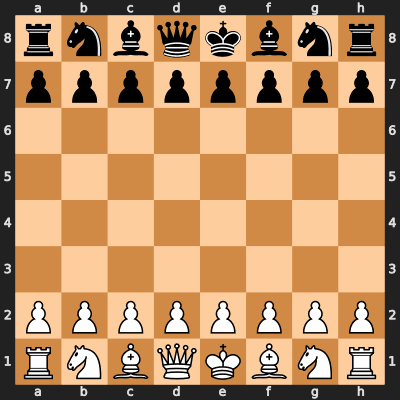

# Chess LLM Agents

A Python project where two local language model agents play chess against each other using LangGraph.

Copyright (c) 2025 Arash Mehrjou. All rights reserved.

## Setup

1. Install dependencies using Poetry:
```bash
poetry install
```

2. Download a local model:
   - Recommended models: LLaMA-2-7B, Mistral-7B, or DeepSeek-7B
   - Convert to GGUF format using llama.cpp
   - Place the model file in the `models` directory

3. Configure the model path in `.env`:
```
MODEL_PATH=models/your-model.gguf
```

## Project Structure

- `agents/`: Contains the LLM agent implementations
- `game/`: Chess game logic and controller
- `models/`: Local model files
- `utils/`: Helper functions and logging
- `main.py`: Entry point for the game
- `game_visualizations/`: Generated board visualizations (created during gameplay)

## Running the Game

```bash
poetry run python main.py
```

The game will run automatically, with each agent taking turns to make moves. The game state and moves will be logged to the console.

## Visualizations

The game generates visual representations of the board state:
- A GIF animation showing the entire game progression
- Individual PNG frames for each move
- PGN file containing the complete game notation

Example of a generated game visualization:


The visualization shows:
- The current board state
- The last move made (highlighted)
- Move numbers and player names
- The complete game progression

## Features

- Two local LLM agents playing chess
- LangGraph-based message passing
- Move validation and game state management
- Detailed logging of game progress
- Visual board state representation
- Random move selection for game variety
- Modular and extensible architecture 